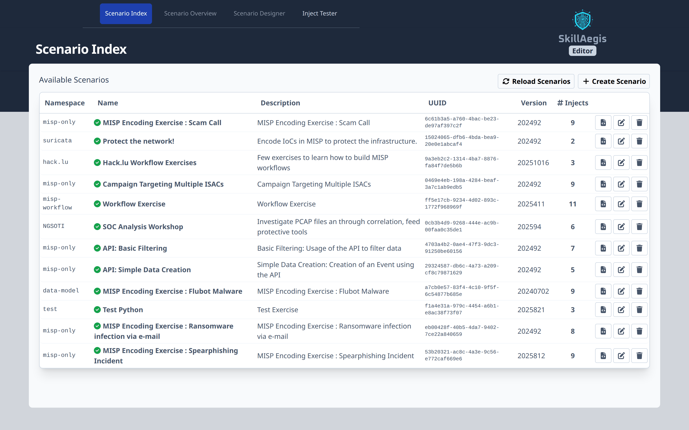

# SkillAegis-Editor
 

**SkillAegis-Editor** is a platform to design exercise scenarios, enhancing skills in applications like MISP and training users in best practices for information management and protective tools.

The Editor allows you to create scenarios under the [Common Exercise Format (CEXF)](https://misp.github.io/cexf/) that can be used by other application such as **[SkillAegis Dashboard](https://github.com/MISP/SkillAegis-Dashboard)**.

> [!NOTE]  
> Consider running this application with **[SkillAegis](https://github.com/MISP/SkillAegis)** for Production.



*List of all available scenarios, with their CEXF validity, target namespace and inject count.*

## Designing a scenario

A scenario is a set of **injects** (tasks a trainee performs in a target tool) plus a parallel
**flow** describing when each fires, what it depends on, and how it is scored. Authoring is split
across two linked surfaces that share one visual and data model, and remains **tool-agnostic** —
MISP, Suricata, webhook and Python targets are all first-class.

### Scenario Map

The scenario overview is a drag-driven **map** of the whole exercise. Injects are laid out
automatically by dependency depth: injects with no prerequisite hang off the **start rail**,
and timed injects sit in a dedicated timed lane. Drag an inject's ▸ handle — or a whole card —
onto another inject to set it as a **prerequisite**; drop a card onto the start rail or the timed
lane to change when it fires; click a connection to remove it. Cycles and self-links are rejected.


*The Scenario Map replaces the old read-only dependency table — wire up the flow of the exercise by direct manipulation.*

### Guided inject designer

Clicking an inject opens a focused **3-step designer** that separates the three concerns that used
to share one flat form:

- **Task** — *what the trainee does*: name, description and the target tool.
- **Flow** — *when it runs*: triggers (`manual`, `startex`, `periodic`, `triggered_at`), timing,
  prerequisite, and advanced chaining (`followed_by` / `completion_trigger`).
- **Completion** — *how it's scored*, with a live test built in.


*Each inject is edited through a Task → Flow → Completion stepper instead of one undifferentiated wall of fields.*

### Completion rules & live test

Writing evaluations used to be the hardest, most error-prone part of authoring. The **Completion**
step turns it into a guided experience: build the scoring rule as `field → operator → values` rows,
or use the **query builder** (a `FROM / WHERE / CHECK` form) to express `data_filtering` conditions
without writing jq by hand. Every condition shows the generated jq, a plain-English summary, and what
it extracts from the sample. A raw jq/JSON escape hatch is always one toggle away for power users.

The panel on the right **re-runs the rule against sample data as you type**, showing a pass/fail
verdict, the combined score, and a per-condition breakdown — so you never have to leave the page to
validate an evaluation.


*Build a completion rule on the left and watch it pass or fail against sample data on the right, in the same view.*

> [!TIP]
> Deeper references live under [`docs/`](./docs): [evaluation strategies](./docs/evaluation-strategies.md)
> and the [comparison operators reference](./docs/comparison-operators.md).


## Installation

To get started with SkillAegis-Editor, follow these steps:

0. Ensure Python **3.10** or higher is installed.
    ```bash
    python -V
    ```
1. Initialize submodules
   ```bash
   git submodule update --init --recursive
   ```
2. Install dependencies
   ```bash
   python3 -m venv venv
   source venv/bin/activate
   pip3 install -r requirements.txt
   ```
3. Clone the configuration file
    ```bash
    cp config.py.sample config.py
    ```
    - [optional] Update the configuration
4. Start the application
   ```bash
   # Usage: ./start.sh --exercise_folder <folder> [--host <host>] [--port <port>]
   ./start.sh --exercise_folder scenarios/
   ```

## Development

### Back-end
```bash
source venv/bin/activate
fastapi dev main.py
```

### Front-end

#### Project Setup

```sh
npm install
```

#### Compile and Hot-Reload for Development

```sh
npm run dev
```

#### Compile and Minify for Production

```sh
npm run build
```

#### Lint with [ESLint](https://eslint.org/)

```sh
npm run lint
```

# License
This software is licensed under GNU Affero General Public License version 3

```
Copyright (c) 2024 Sami Mokaddem
Copyright (c) 2024 CIRCL - Computer Incident Response Center Luxembourg
```
